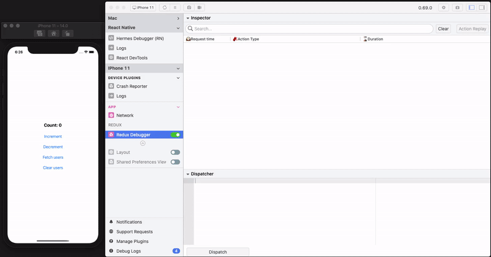

# redux-middleware-flipper
React native redux middleware to send redux logs to the [companion Flipper desktop plugin.](https://github.com/aseemc/flipper-plugin-react-native-redux-debugger)

> ❗For Flipper setup in your react native project, please refer to the [setup guide.](https://fbflipper.com/docs/getting-started/react-native)



## Features ✨

- Log all dispatched redux actions
- Show details about the action dispatched (action, state diff and the current state)
- Custom action dispatcher
- Replay selected actions
- Search for a specific action type

## Setup guide ✍🏻

- Install the `redux-middleware-flipper` and `react-native-flipper`
```bash
yarn add redux-middleware-flipper react-native-flipper

# for iOS
cd ios && pod install
```
- Add the middleware in dev mode in your redux store setup file
```javascript
if (__DEV__) {
  const reduxDebugger = require('redux-middleware-flipper').default;
  middleware.push(reduxDebugger());
}
```
- Open Flipper desktop app and install the plugin 
```
Manage Plugins > Install Plugins > search "RNReduxDebugger" > Install
```

## References 📚

- Getting started with [Flipper](https://fbflipper.com/docs/tutorial/intro)
